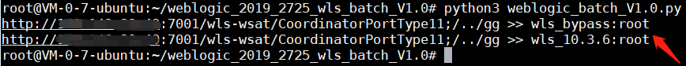

# weblogic_2019_2725_wls_batch

weblogic CVE-2019-2725漏洞Exp，针对wls-wsat组件的漏洞，使用三个exp进行批量检测。当时写的时候没想太多，就是验证漏洞存在就完了，于是脚本的功能就是对漏洞存在的机器输出whoami命令的结果。

## 使用

python3 weblogic_batch_V1.0.py 

（将目标放入target.txt，一行一个。）

## 示例

**单个验证**

